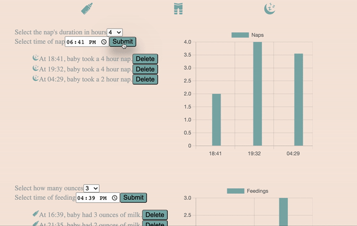

# # Newborn Log #

## Overview ##
This app allows the user to keep track of newborns' feedings, naps, and diaper changes. It also allows the user to have an overview of those activities in a chart.

This app was built with React Hooks, Express.js, Node.js, mySQL, as well as Chart.js

## How To Get Started ##
```
npm install
npm run react-dev
npm start
```

## Demo ##
